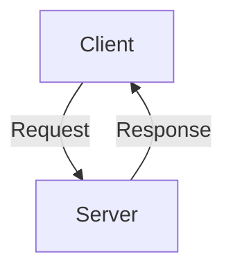

# Documentation Guidelines

This guide provides best practices and guidelines for writing effective documentation for NeuralLog components.

## Table of Contents

- [General Principles](#general-principles)
- [Documentation Types](#documentation-types)
- [Structure and Organization](#structure-and-organization)
- [Writing Style](#writing-style)
- [Markdown Formatting](#markdown-formatting)
- [Code Examples](#code-examples)
- [Images and Diagrams](#images-and-diagrams)
- [API Documentation](#api-documentation)
- [Versioning](#versioning)
- [Review Process](#review-process)

## General Principles

When writing documentation for NeuralLog, follow these general principles:

1. **Accuracy**: Ensure all information is correct and up-to-date
2. **Clarity**: Write in clear, concise language that is easy to understand
3. **Completeness**: Cover all necessary aspects of the topic
4. **Consistency**: Use consistent terminology, formatting, and structure
5. **Audience Awareness**: Consider the knowledge level of your audience
6. **Searchability**: Use descriptive headings and keywords to make content easy to find
7. **Maintainability**: Organize content to be easy to update and maintain

## Documentation Types

NeuralLog documentation includes several types of content, each with its own purpose:

### README.md

The README.md file serves as the entry point to a repository and should:

- Provide a brief overview of the component
- List key features
- Include installation instructions
- Show a quick start example
- Link to more detailed documentation

### API Reference

API reference documentation should:

- Document all public APIs, endpoints, methods, and parameters
- Include request and response examples
- Explain authentication requirements
- Document error codes and responses

### Architecture Documentation

Architecture documentation should:

- Explain the component's design and structure
- Include diagrams showing relationships between components
- Describe data flow and interactions
- Explain design decisions and trade-offs

### Configuration Documentation

Configuration documentation should:

- List all configuration options
- Explain the purpose of each option
- Provide default values
- Include examples for common scenarios

### User Guides

User guides should:

- Provide step-by-step instructions for common tasks
- Include screenshots or diagrams where helpful
- Explain concepts in user-friendly terms
- Address common questions and issues

### Development Guides

Development guides should:

- Explain how to set up a development environment
- Describe the development workflow
- Document coding standards and practices
- Provide guidance for contributing to the project

## Structure and Organization

### Document Structure

Each document should follow a consistent structure:

1. **Title**: Clear, descriptive title at the top (# Title)
2. **Introduction**: Brief overview of what the document covers
3. **Prerequisites** (if applicable): What the reader needs to know or have installed
4. **Main Content**: Organized into logical sections with clear headings
5. **Examples**: Practical examples demonstrating the concepts
6. **Troubleshooting** (if applicable): Common issues and their solutions
7. **Related Resources**: Links to related documentation

### Heading Hierarchy

Use a consistent heading hierarchy:

- `# Title`: Document title (only one per document)
- `## Section`: Major sections
- `### Subsection`: Subsections within major sections
- `#### Minor Subsection`: Further divisions if needed

### Cross-References

Use relative links to reference other documentation:

```markdown
See the [API Reference](../api.md) for more details.
```

For links to sections within the same document:

```markdown
See the [Code Examples](#code-examples) section below.
```

## Writing Style

### Voice and Tone

- Use a professional, friendly tone
- Write in the present tense
- Use active voice rather than passive voice
- Address the reader directly using "you"

### Clarity and Conciseness

- Use simple, direct language
- Keep sentences and paragraphs short
- Avoid jargon and technical terms without explanation
- Define acronyms on first use

### Consistency

- Use consistent terminology throughout the documentation
- Maintain consistent capitalization for product names and technical terms
- Use the same formatting for similar elements

## Markdown Formatting

### Basic Formatting

- **Bold** for emphasis: `**bold**`
- *Italic* for slight emphasis or introducing terms: `*italic*`
- `Code` for code snippets, file names, and technical terms: `` `code` ``
- [Links](#) for references to other documents or external resources: `[Example Link](https://example.com)`

### Lists

Use ordered lists for sequential steps:

```markdown
1. First step
2. Second step
3. Third step
```

Use unordered lists for non-sequential items:

```markdown
- Item one
- Item two
- Item three
```

### Tables

Use tables to present structured data:

```markdown
| Header 1 | Header 2 | Header 3 |
|----------|----------|----------|
| Cell 1   | Cell 2   | Cell 3   |
| Cell 4   | Cell 5   | Cell 6   |
```

### Blockquotes

Use blockquotes for notes, warnings, or important information:

```markdown
> **Note**: This is an important note.

> **Warning**: This is a warning.
```

## Code Examples

### Code Blocks

Use fenced code blocks with language specification:

````markdown
```typescript
function example(): string {
  return 'Hello, world!';
}
```
````

### Inline Code

Use backticks for inline code:

```markdown
Use the `example()` function to get a greeting.
```

### Example Best Practices

- Keep examples simple and focused
- Include comments to explain complex parts
- Show both the code and the expected output
- Use realistic variable and function names
- Include error handling where appropriate

## Images and Diagrams

### Image Guidelines

- Use descriptive file names
- Place images in the `static/img/` directory
- Use alt text to describe the image
- Keep image files small and optimized

### Image Syntax

```markdown

```

### Diagrams

For complex concepts, include diagrams:

- Use tools like [Mermaid](https://mermaid-js.github.io/mermaid/) for flowcharts and sequence diagrams
- Include both the diagram and a text explanation
- Keep diagrams simple and focused

### Mermaid Diagrams

Mermaid diagrams can be included directly in Markdown:

````markdown

````

## API Documentation

### Endpoint Documentation

Document each API endpoint with:

- HTTP method and path
- Description of what the endpoint does
- Request parameters and body
- Response format and status codes
- Authentication requirements
- Example request and response

Example:

````markdown
### Get User

`GET /api/users/:id`

Retrieves a user by their ID.

#### Parameters

| Name | Type | Description |
|------|------|-------------|
| `id` | string | The user's ID |

#### Response

```json
{
  "id": "123",
  "name": "John Doe",
  "email": "john@example.com"
}
```

#### Status Codes

| Code | Description |
|------|-------------|
| 200 | Success |
| 404 | User not found |
| 401 | Unauthorized |
````

### Method Documentation

Document each method with:

- Method signature
- Description of what the method does
- Parameters and their types
- Return value and type
- Exceptions or errors
- Example usage

Example:

````markdown
### `createUser(name: string, email: string): Promise<User>`

Creates a new user with the given name and email.

#### Parameters

- `name`: The user's name
- `email`: The user's email address

#### Returns

A Promise that resolves to the created User object.

#### Throws

- `ValidationError`: If the email is invalid
- `DuplicateError`: If a user with the email already exists

#### Example

```typescript
const user = await createUser('John Doe', 'john@example.com');
console.log(user.id); // "123"
```
````

## Versioning

### Version References

When documentation is specific to a particular version:

- Clearly indicate the version number
- Use version ranges where appropriate
- Consider adding version tabs for different versions

Example:

```markdown
## Feature X (v1.2.0+)

This feature is available in version 1.2.0 and later.
```

### Deprecation Notices

When documenting deprecated features:

- Clearly mark them as deprecated
- Indicate when they will be removed
- Provide migration guidance

Example:

```markdown
> **Deprecated**: This method is deprecated in v2.0.0 and will be removed in v3.0.0. Use `newMethod()` instead.
```

## Review Process

### Self-Review

Before submitting documentation:

1. Read it from the perspective of someone unfamiliar with the topic
2. Check for technical accuracy
3. Verify that all links work
4. Ensure code examples run correctly
5. Check for spelling and grammar errors

### Peer Review

Documentation should be reviewed by:

1. A technical expert to verify accuracy
2. Another writer to check clarity and style
3. A user representative to ensure it meets user needs

### Feedback Loop

Continuously improve documentation based on:

1. User feedback
2. Support questions
3. Issue reports
4. Usage analytics

## Conclusion

Following these guidelines will help ensure that NeuralLog documentation is consistent, accurate, and useful. Remember that good documentation is an ongoing process—regularly review and update documentation to keep it current with the latest features and best practices.
