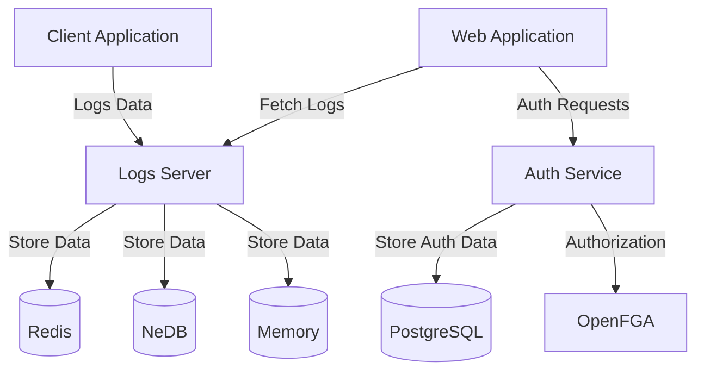

# Introduction

Welcome to the NeuralLog documentation! This guide will help you understand, set up, and use NeuralLog for logging and monitoring AI model interactions.

## What is NeuralLog?

NeuralLog is a distributed system designed for logging and monitoring AI model interactions. It provides:

- **Centralized Logging**: Store all AI model interactions in one place
- **Structured Data**: Organize logs with structured data
- **Search and Filtering**: Find specific logs quickly
- **Statistics and Analytics**: Gain insights from log data
- **Multi-tenancy**: Support multiple tenants with isolation
- **Authentication and Authorization**: Secure access to logs

## Key Features

- **Multiple Storage Options**: Memory, NeDB, and Redis
- **RESTful API**: Easy integration with any application
- **Multiple SDKs**: Client libraries for various programming languages:
  - **TypeScript SDK**: For Node.js and browser applications
  - **Java SDK**: For Java applications with adapters for Log4j, SLF4J, and more
  - **C# SDK**: For .NET applications with adapters for Microsoft.Extensions.Logging, Serilog, and NLog
  - **Python SDK**: For Python applications with adapters for the standard logging module and Loguru
  - **Go SDK**: For Go applications with adapters for the standard log package, logrus, and zap
- **Web Dashboard**: Visualize logs and statistics
- **Fine-grained Authorization**: Control access to logs
- **Namespacing**: Isolate logs by tenant or environment
- **Statistics**: Track usage patterns and performance

## Components

NeuralLog consists of several independent components:

- **Logs Server**: The central component that handles log storage, retrieval, and statistics
- **Web Application**: The user interface for interacting with logs and visualizing statistics
- **Auth Service**: Handles authentication and authorization for the system
- **Shared Package**: Contains common types and utilities used across components
- **SDKs**: Client libraries for interacting with the logs server:
  - **TypeScript SDK**: For Node.js and browser applications
  - **Java SDK**: For Java applications
  - **C# SDK**: For .NET applications
  - **Python SDK**: For Python applications
  - **Go SDK**: For Go applications

## Getting Started

To get started with NeuralLog, follow these guides:

1. [Introduction to NeuralLog](intro.md): Learn about NeuralLog
2. [Quick Start Guide](getting-started/quick-start.md): Get started quickly
3. [Components](components/auth/overview.md): Explore the components
   - [Auth](components/auth/overview.md): Authentication and authorization service
   - [Log Server](components/log-server/overview.md): Central logging service
   - [Web](components/web/overview.md): Web interface
   - [MCP Client](components/mcp-client/overview.md): Model Context Protocol client
4. [Development](development/environment-setup.md): Development guides
5. [Deployment](deployment/docker.md): Deployment guides

## Architecture

NeuralLog follows a microservices architecture with the following components:

For more details, see the [Architecture](architecture/index.md) page.

## Repository Structure

NeuralLog is not a monorepo. Instead, it consists of several independent repositories:

- **server**: The logs server implementation
- **web**: The web application frontend
- **auth**: The authentication and authorization service
- **shared**: Common types and utilities
- **specs**: Project specifications and GitHub issues
- **docs**: Project documentation
- **infra**: Infrastructure configuration

For more details on managing these repositories, see the Development section.

## Contributing

We welcome contributions to NeuralLog! To contribute:

1. Fork the relevant repository
2. Create a feature branch
3. Make your changes
4. Submit a pull request

Please follow the coding standards and write tests for your changes.

## License

NeuralLog is licensed under the ISC License. See the LICENSE file in each repository for details.
