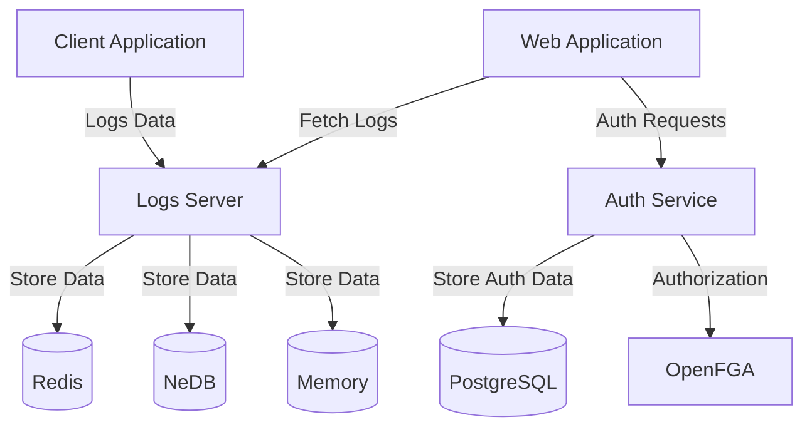

# NeuralLog Architecture

NeuralLog is a distributed system designed for logging and monitoring AI model interactions. It consists of several independent components that work together to provide a comprehensive logging solution.

## System Components

### Core Components

- **TypeScript Client SDK**: The cornerstone of NeuralLog's zero-knowledge architecture, handling all client-side encryption, decryption, and key management.
- **Logs Server**: The central component that handles encrypted log storage, retrieval, and statistics without ever seeing plaintext data.
- **Web Application**: The user interface for interacting with logs and visualizing statistics, using the client SDK for all cryptographic operations.
- **Auth Service**: Handles authentication and authorization for the system without access to encryption keys or plaintext data.
- **Shared Package**: Contains common types and utilities used across components.

### Storage Options

NeuralLog supports multiple storage backends:

- **Memory Storage**: In-memory storage for development and testing.
- **NeDB Storage**: File-based storage for small deployments.
- **Redis Storage**: Scalable storage for production deployments.

## Component Interaction

## Repository Structure

NeuralLog is not a monorepo. Instead, it consists of several independent repositories:

- **server**: The logs server implementation.
- **web**: The web application frontend.
- **auth**: The authentication and authorization service.
- **shared**: Common types and utilities.
- **specs**: Project specifications and GitHub issues.
- **docs**: Project documentation.
- **infra**: Infrastructure configuration.
- **SDKs**: Client libraries for various programming languages:
  - **typescript-sdk**: TypeScript/JavaScript SDK
  - **java-sdk**: Java SDK
  - **csharp-sdk**: C# SDK
  - **python-sdk**: Python SDK
  - **go-sdk**: Go SDK

Each repository is independent but relies on the shared package for common types and utilities.

## Data Flow

1. **Client Applications** encrypt log data client-side using the **TypeScript Client SDK** before sending to the **Logs Server**.
2. The **Logs Server** stores the encrypted data in the configured storage backend (Memory, NeDB, or Redis) without ever seeing plaintext.
3. The **Web Application** retrieves encrypted log data from the **Logs Server** and decrypts it client-side using the **TypeScript Client SDK**.
4. The **Web Application** authenticates users through the **Auth Service** without transmitting passwords.
5. The **Auth Service** uses **OpenFGA** for fine-grained authorization while maintaining zero-knowledge principles.

## Authentication and Authorization

NeuralLog uses a zero-knowledge token-based authentication system:

1. Users authenticate with the **Auth Service** through the **TypeScript Client SDK**, which handles password-based key derivation client-side. Passwords are never sent to the server.
2. The client receives a JWT token which is exchanged for resource-specific tokens when accessing logs.
3. API keys contain cryptographic material needed to derive encryption keys, but the server only stores verification hashes.
4. The **Auth Service** uses **OpenFGA** to determine if a user has permission to access specific logs without having access to the log content.
5. Even with full access to the server infrastructure, an attacker cannot read logs without the proper API keys or master secrets.

## Storage Architecture

### Memory Storage

- Simple in-memory storage using JavaScript objects.
- Data is lost when the server restarts.
- Suitable for development and testing.

### NeDB Storage

- File-based storage using NeDB.
- Data is persisted to disk.
- Suitable for small deployments.

### Redis Storage

- Scalable storage using Redis.
- Data is persisted to disk with AOF (Append-Only File).
- Suitable for production deployments.

## Namespacing

NeuralLog supports namespacing to isolate logs by tenant or environment:

- Each log belongs to a namespace.
- The default namespace is "default".
- Namespaces are used for multi-tenancy.

## Statistics

NeuralLog collects statistics about logs:

- Number of logs per namespace.
- Number of entries per log.
- First and last entry timestamps.
- These statistics are used for monitoring and visualization.

## SDKs

NeuralLog provides SDKs for various programming languages, all built on the principles of the TypeScript Client SDK:

- **TypeScript Client SDK**: The cornerstone of NeuralLog's zero-knowledge architecture, handling all encryption, decryption, and key management client-side. No sensitive data ever leaves the client unencrypted.
- **Java**: For Java applications with adapters for popular logging frameworks, implementing the same zero-knowledge principles.
- **C#**: For .NET applications with adapters for popular logging frameworks, implementing the same zero-knowledge principles.
- **Python**: For Python applications with adapters for popular logging frameworks, implementing the same zero-knowledge principles.
- **Go**: For Go applications with adapters for popular logging frameworks, implementing the same zero-knowledge principles.

Each SDK provides a simple API for logging messages and retrieving logs while ensuring that all cryptographic operations happen client-side. This means that even if the entire server infrastructure is compromised, an attacker cannot access plaintext logs without the proper API keys or master secrets.
